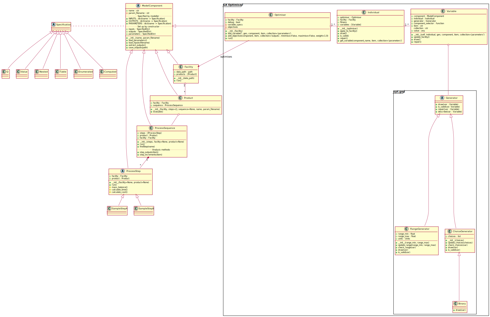

# PyBioPharma user / modeller guide

## Quick start

We recommend using BioPharma from a [Jupyter Notebook][]. Run the following
commands in your terminal to start this (changing the first line to match
where you placed the PyBioPharma files):

On Windows running Anaconda Prompt, PowerShell or Command:
```powershell
cd /D %HOMEDRIVE%%HOMEPATH%\Desktop\PyBioPharma
activate biopharma
jupyter notebook
```

On Mac OS and Linux, or Windows running Git Bash:
```sh
cd ~/Desktop/PyBioPharma
source activate biopharma
jupyter notebook
```

Your browser should then open and show a list of available notebooks (as
well as the other files in the PyBioPharma folder). Each notebook
demonstrates a different aspect of the system:

* User_demo.ipynb is a good starting point, explaining how to run a model
* Single_step_demo.ipynb explains how to run just one component of the model
* Optimisation_demo.ipynb explains how to use the Genetic Algorithm optimiser
* Looping_demo.ipynb shows how to do a brute-force optimisation of one parameter


## Updating the models

Since PyBioPharma is written in Python, some knowledge of this language is
helpful for making changes. It is fairly intuitive and easy to learn. The
[Software Carpentry Python lessons][swc-python] are available online, and
Research IT Services run regular [Software Carpentry workshops][RITS-train]
covering this material. We also run a longer course "An introduction to
research programming using Python" which goes into more depth.

The `pip install -e .` line above means that BioPharma is installed in
'developer' mode - any changes you make to the Python source code will
immediately be reflected in the installed version, which is very helpful
for experimentation.

We recommend installing [git][] following the
[Software Carpentry instructions][git-swc] and tracking your work in a
branch using this Version Control System. This provides many benefits both
for you and the group, making it easy to go back to previous versions of the
model, work on different variants, and share changes with others. See the file
[git.md](git.md) for more about how to do this. The RITS Software Carpentry
workshops cover git use as well.


### How the modelling framework is structured

The framework is written in an [object-oriented][OOP] fashion, meaning that
model components contain both data and also functions (known as methods) that
do things with that data. Components can also _inherit_ methods (and other
properties) from other components. We use the capability to define an abstract
`ModelComponent` with functionality common to all components, as well as a
`ProcessStep` providing the basis for all unit operations.

To learn more about object-oriented programming in Python, we recommend the
[RITS Python course][RITS-train] mentioned above, particularly the
[classes topic][RITS-python-classes]. There is also a reasonable introduction
in the [Python tutorial Wikibook][Wikibook-Python].

The main components in the framework are shown diagrammatically in the following
UML figure, and explained below.



The file in which each is component is defined is given in brackets. All these
files are in the [biopharma](../biopharma) folder. Each component (and each
method thereof) is documented further within the source code.

* `ModelComponent` ([core.py](../biopharma/core.py)): the base class for core
  functionality. You shouldn't need to change this. As well as defining the
  parameter system (see below) it provides common utility functions such as
  `load_parameters` and `save_outputs`.
* `Facility` ([facility.py](../biopharma/facility.py)): specifies parameters
  and outputs for the facility as a whole.
* `Product` ([product.py](../biopharma/product.py)): this class represents a
  product being produced by the facility. It wraps the sequence of steps that
  produce the product. It specifies some product-level outputs and parameters.
* `ProcessSequence` ([process_sequence.py](../biopharma/process_sequence.py)):
  Encapsulates a list of individual process steps and handles running each
  in turn.
  This class also has two helper methods for reporting on per-step outputs:
  step_outputs and step_increments. See the demo notebook for more on these.
* `ProcessStep` ([process_step.py](../biopharma/process_step.py)): this is
  the base class for individual process steps. It specifies inputs, outputs,
  and parameters that are common to all steps, along with common functionality.
  See the 'Implementing process steps' section for more details.
* Each individual process step class can be found within the
  [biopharma/process_steps](../biopharma/process_steps) folder.


### How components work

The main feature of components in this framework is that it is possible to
specify their inputs, outputs, and parameters. Any assignment to one of these,
whether by model equations or in input files, is then checked against the
specification to ensure that it matches. The specifications also contain
documentation for users explaining what the parameter/input/output is for.
The specifications are given in class properties called `INPUTS`, `OUTPUTS`,
and `PARAMETERS`, and these determine what is allowed in the dictionaries
`self.inputs`, `self.outputs`, and `self.parameters` respectively.

Specifications are cumulative: a subclass can add to or override entries
defined in the base class. So the `ProcessStep` class, for instance, defines
inputs and outputs common to all process steps, and some individual step types
add further outputs.

Several types of specification are possible; these are defined in the file
[specs.py](../biopharma/specs.py):

* `Q`: the most common, represents a quantity in the given units. Values
  assigned must be in the same dimensions as the specified unit, and will be
  converted to match exactly when assigned.
* `Value`: represents a value of the specified type, typically used for
  boolean (true/false) parameters.
* `Enumerated`: represents values chosen from a predefined list.
* `Table`: specifies a table of parameters read from a CSV file. This is the
  most complex specification type.
  The names and types of each column must be given, where the type can specify
  a quantity measured in some units; either fixed or given by another column.
* `Nested`: this specification allows a nested group of related parameters to
  be defined.
* `Computed`: this specifies that the entry cannot be defined independently,
  but is computed automatically from other parameters (typically) by some
  function. It is most useful where several parameters are read from a Table
  row corresponding to ID selected by another parameter.

All component types also take 2 standard parameters in their 'constructors',
the method called to create an instance of the component. These are:

* `name`: allows you to give a human-readable name for the component. This
  defaults to the class name. The ProcessSequence class has a method to find
  a specific step by name.
* `param_filename`: used to specify the file from which parameters for this
  component should be read. This defaults to the component name, with a .yaml
  extension.


### Implementing process steps (unit operations)

Each process step class must define 3 methods that implement the model
equations for that step. These methods are called in the following order by the
base `ProcessStep` class' `run` method, which is called when model is run to
simulate the facility's operation.

1. `mass_balance`: performs the biochemistry of the process step.
2. `calculate_time`: calculates how long this process step would take to run in
   the facility.
3. `calculate_cost`: calculates the cost of running this process step in the
   facility.

Each of these methods performs some calculations based on the step's inputs and
parameters, possibly also using properties of the product or facility, and
storing the results in the `self.outputs` dictionary.

Each of these methods also takes a single function argument called `self`. This
stores the specific instance of the process step for which the methods are
called, and so is where the inputs etc. for that specific instance are stored.
This is why you will see references to `self.inputs` and so on - the code is
accessing the inputs of that particular instance of the step, rather than any
other instance that might exist in the process sequence (there are typically
multiple chromatography steps for example), or even other instances used to
produce different products within the facility.

Note that in the current model, the outputs from process steps are assumed to
be incremental. That is, the inputs to the first step in the sequence will
mostly be zero (except for the volume). Each step will then add on (or
subtract) its contribution and store the result in its outputs. To determine
the contribution of a single step to one of the outputs, you therefore need to
subtract the input value from the output value.

Values calculated by the process step methods will be stored in one of 3 ways:

1. As step outputs, by being assigned to an entry within the `self.outputs`
   dictionary (e.g. `self.outputs['mass']`). These form the outputs of the step
   that can be read by other components.
2. As "member variables", e.g. `self.my_member_variable = ...`. This type of
   variable has its name prefixed by `self.` and is stored as part of the
   process step instance. This is done when the variable's value is needed by
   other methods (e.g. it is calculated as part of the mass balance, but its
   value is also needed to calculate the step's costs) but is not an overall
   output of the step.
3. As "local variables", where they are assigned to a name with no `self.`.
   This is done when the value is only needed temporarily within the current
   method in order to calculate some other quantity.

A few functions are defined in the [util.py](../biopharma/util.py) file. These
implement operations such as rounding for quantities with units, ensuring that
the quantities are converted to expected units before rounding the magnitudes
(since rounding to the nearest day is rather different from rounding to the
nearest hour!). These functions are typically called using `bp.floor` etc.

From a process step, the product it is producing can be accessed as
`self.product`, and the facility instance by `self.facility`. This allows steps
to read parameters for the product or facility as a whole.


## Testing the models

Extensive tests are provided for the core models, and if you make changes
to the models you will want to update the tests as well before sharing your
changes with others. This practice helps to ensure that the models are still
behaving as expected in various scenarios.

Running the tests is done from the terminal. Before running the first time
you will need to install some extra software with
```sh
pip install -r requirements/test.txt
```
You can then run all the tests just with
```sh
pytest
```

The test code can be found in the [biopharma/test](../biopharma/test) folder.


[Jupyter Notebook]: http://jupyter.readthedocs.io/en/latest/index.html
[swc-python]: http://swcarpentry.github.io/python-novice-inflammation
[RITS-train]: http://www.ucl.ac.uk/isd/services/research-it/training
[git]: http://git-scm.org/
[git-swc]: https://swcarpentry.github.io/workshop-template/#git
[OOP]: https://en.wikipedia.org/wiki/Object-oriented_programming
[RITS-python-classes]: http://rits.github-pages.ucl.ac.uk/doctoral-programming-intro/notebooks/101Classes.html
[Wikibook-Python]: https://en.wikibooks.org/wiki/A_Beginner%27s_Python_Tutorial/Classes
